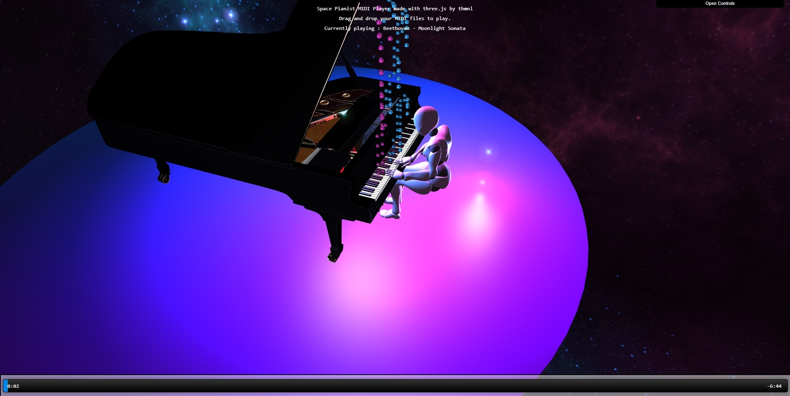

# MidiPlayerJS3D
JavaScript drag &amp; drop MidiPlayer3D  
Result : https://thibaultmanuel.com/MIDIPlayer3D/   https://www.youtube.com/watch?v=n7csc6kkAi8 

## Usage
Expose your MIDIPlayer3D.html 
For example, with Python : `python -m http.server 8000`  
Then go to http://localhost:8000/MIDIPlayer3D.html 

### THE GRAND PIANO MODEL IS NOT INCLUDED
You can buy it from https://www.cgtrader.com/3d-models/furniture/other/grand-piano-ue4-ready, then you will need to remove the keyboard and the room with blender. 
